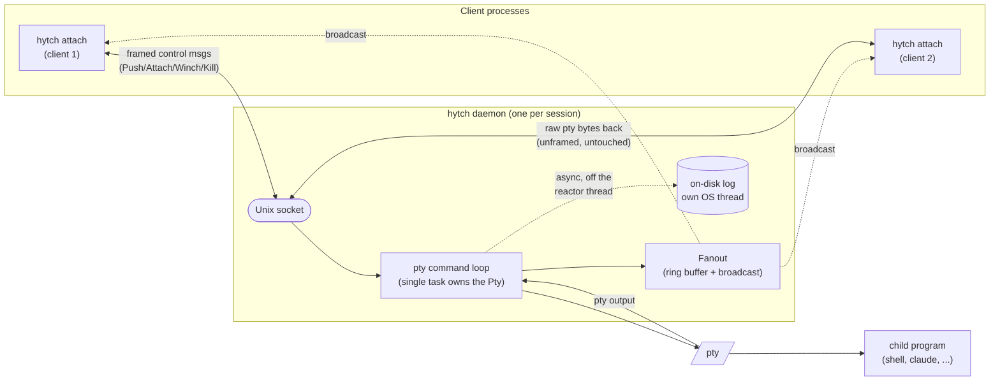

# hytch

A fast, lean terminal session daemon: attach, detach, and resume exactly
where you left off — across disconnects, crashes, and reboots — with no
terminal emulation in the way, so mouse reporting, scroll, and true-color
pass through untouched.

Independent reimplementation inspired by [`atch`](https://github.com/mobydeck/atch)
and `dtach`'s design goals — not a fork, no shared code (see [Licensing](#licensing)).
Built as a ground-up Rust rewrite after a [code review](#why-rust) of `atch`
surfaced concrete memory-safety and throughput bugs; this project exists to
fix those structurally, with real test coverage and benchmark evidence
instead of assertions.

```sh
hytch start work -- claude    # launch something long-running, detached
hytch work                    # attach — or reattach after any disconnect
# ^\ to detach; the session and program keep running
```

## Status

Functional and end-to-end tested (100 tests, `cargo test --workspace`),
manually verified against the actual target scenario — start a detached
session, disconnect, reconnect, see full history — including a real crash
(`SIGKILL` on the daemon process itself) and a stuck-write scenario that
was found, fixed, and locked in with a regression test. See
[Known gaps](#known-gaps) for what's deliberately not built yet.

## Install

### Prerequisites

- Linux, x86_64 or aarch64. (macOS/BSD are explicitly out of scope — see
  the plan doc referenced in [Development](#development).)
- Nothing else, for the release binary: it's static (musl, no dynamic
  libc dependency) — copy it anywhere and run it.

### Option 1: scripted install (recommended)

```sh
curl -fsSL https://raw.githubusercontent.com/artisenalcode/hytch/main/install.sh | bash
```

Downloads the latest release for your architecture and installs to
`/usr/local/bin/hytch` — one canonical location already on `PATH` for every
shell, interactive or not (a user-writable default like `~/.local/bin`
resolves differently for, say, an `ssh host "hytch ..."` remote command,
which runs non-interactively and never sources the rc file that puts
`~/.local/bin` on `PATH` — the two-location split is a real footgun, not a
hypothetical one). Not writable by your user, as is typical for
`/usr/local/bin`? The script retries the copy with `sudo`, prompting for
your password once. Re-running it upgrades in place. Override the version
or install location with env vars:

```sh
HYTCH_VERSION=v0.1.0 HYTCH_INSTALL_DIR="$HOME/.local/bin" \
  curl -fsSL https://raw.githubusercontent.com/artisenalcode/hytch/main/install.sh | bash
```

### Option 2: manual release download

```sh
arch=$(uname -m | sed 's/x86_64/amd64/;s/aarch64/arm64/')
curl -fsSL -o hytch.tgz \
  "https://github.com/artisenalcode/hytch/releases/latest/download/hytch-linux-${arch}.tgz"
tar -xzf hytch.tgz hytch
sudo install -m 755 hytch /usr/local/bin/hytch   # or ~/.local/bin, no sudo needed
```

Pin a specific version by replacing `latest/download` with
`download/vX.Y.Z` (e.g. `download/v0.1.0`).

### Option 3: from source

```sh
git clone https://github.com/artisenalcode/hytch
cd hytch
cargo build --release
sudo install -m 755 target/release/hytch /usr/local/bin/hytch
```

Requires a Rust toolchain (`rustup.rs`); no other build dependencies —
`rustix`'s default backend talks to the kernel directly, no C toolchain or
system libraries needed even for the static-musl release target.

### Verify

```sh
hytch --version   # e.g. "hytch 0.1.0 (a1b2c3d4)" -- semver + build commit
hytch list        # "(no sessions)" on a fresh install
```

### Upgrade

Re-run whichever install method you used — every option overwrites the
existing binary in place. A running daemon keeps running under its
already-loaded old binary until it's next stopped/restarted (killing a
session and starting a new one, or a reboot); nothing forces existing
sessions to restart on upgrade.

### Uninstall

```sh
hytch list                       # make sure nothing's running first
sudo rm /usr/local/bin/hytch     # or wherever you installed it
rm -rf ~/.cache/hytch            # session sockets + logs, if you want them gone too
```

### Setting up on a remote server (the actual use case this exists for)

1. Install with any option above, on the server.
2. Optional but recommended — auto-attach on SSH login instead of typing
   `hytch main` every time. Add to `~/.bashrc` / `~/.zshrc` (adjust the
   syntax for your shell; this is zsh):

   ```sh
   # On an interactive SSH login with no session yet, resume (or create) a
   # default session instead of a plain shell. Deliberately not `exec`:
   # exec-replacing the shell means detaching has nowhere to return to,
   # so the whole SSH connection would close on detach instead of
   # dropping you back at a normal prompt in the same connection.
   if [[ -n "$SSH_TTY" && -z "$HYTCH_SESSION" && $- == *i* ]]; then
     hytch main
     # Exit code 90 means the hosted shell actually exited (you typed
     # `exit`/^D), not that you merely detached (^\, exit code 0) --
     # propagate that into a real logout, the same as it would with no
     # session tool in the way at all. Detaching must NOT hit this: the
     # whole point of ^\ is that the SSH connection stays open.
     [[ $? -eq 90 ]] && exit
   fi
   ```

3. `ssh you@your-server` — you're now in a resumable session. `^\` to
   detach (back to a normal prompt, same connection, `main` keeps running
   in the background); type `exit` (or ^D) at the shell instead and you're
   logged off for real, same as a normal SSH session with no multiplexer
   involved — that shell *was* the whole session, so there's nothing left
   to detach to. Close the terminal or lose the connection outright
   instead of either one and the session just keeps running; next login
   reattaches automatically.

No client-side install needed for this — the terminal you SSH from just
needs a normal SSH client. `hytch` only needs to run on the server; the
raw pty passthrough that keeps your mouse/scroll/colors working travels
over the same SSH connection you're already using.

## Usage

| Command | What it does |
|---|---|
| `hytch [<session> [cmd...]]` | Attach to a session, creating it if it doesn't exist. |
| `hytch attach <session>` (`a`) | Strict attach — fails if the session isn't running. |
| `hytch new <session> [cmd...]` (`n`) | Create a session and attach to it. |
| `hytch start <session> [cmd...]` (`s`) | Create a session, detached — no terminal needed. |
| `hytch push <session>` (`p`) | Copy stdin verbatim into a running session. |
| `hytch kill [-f] <session>` (`k`) | Stop a session (SIGTERM, then SIGKILL after a grace period). |
| `hytch clear [<session>]` | Truncate a session's on-disk log. |
| `hytch list [-a]` (`l`/`ls`) | List sessions; `-a` also shows exited ones with a log on disk. |
| `hytch rm <session>` | Remove a stopped session's socket and log. |
| `hytch current` | Print the current session name (for shell prompts). |

Detach with `^\` (configurable via `-e`, or disable with `-E`). Full flag
reference: `hytch --help`.

## Architecture



The one asymmetry that matters: **client→daemon is framed, daemon→client is
not.** Control messages (keystrokes, resize, kill) are length-prefixed
frames; pty output flows back as a raw, unmodified byte stream. That's what
keeps mouse reporting, scroll sequences, and true-color passthrough intact
— there's no terminal emulator re-encoding anything in either direction.

Workspace layout:

- `crates/proto` — the wire framing above; no I/O, no OS calls.
- `crates/session` — session naming/directory/socket-path resolution.
- `crates/daemon` — the daemon itself: pty, ring buffer, on-disk log, fanout.
- `crates/client` — attach-side: raw terminal mode, the attach loop.
- `crates/cli` — the `hytch` binary: subcommand dispatch, daemon launch.

## Comparison

| | tmux / screen | atch (C) | hytch |
|---|---|---|---|
| Terminal emulation | Yes — re-encodes the stream | No | No |
| Mouse/scroll passthrough | Often breaks, needs config | Untouched | Untouched |
| History survives daemon exit/reboot | No (memory only) | Yes, on disk | Yes, on disk |
| Background start (no terminal needed) | Yes | Yes | Yes |
| Multiple panes/windows | Yes | No | No |
| Memory safety | N/A (mature C) | Manual (see [findings](#why-rust)) | Compiler-enforced |
| Language | C | C | Rust |

hytch and atch solve the same narrow problem (one program, one resumable
session, zero terminal re-encoding); tmux/screen solve a different, bigger
one (a full multiplexer). Pick hytch/atch when you want the narrow tool;
pick tmux/zellij when you actually want split panes and window management.

## Benchmarks

Real numbers, reproducible commands, methodology, and an honest negative
result (not just favorable ones) in [`BENCHMARKS.md`](BENCHMARKS.md).
Headline: a 1 MiB `push` completes in ~10–30ms versus atch's ~3.76s on the
same machine — **~150–300x** — directly attributable to fixing the 8-byte
push cap below. A small, realistic push is sub-10ms on both; the win is
specific to bulk transfer, not a universal claim.

## Why Rust

This wasn't a "rewrite it in Rust for fun" — it followed a code review of
`atch` that surfaced nine concrete findings, several of them real memory-
safety bugs, not style complaints. Each design choice below retires a
specific one, cited by number:

| Design choice | Retires |
|---|---|
| `tokio::net::UnixListener` + per-client task, no `select()`/`fd_set` | An unbounded `fd_set` with no `FD_SETSIZE` guard — real stack corruption risk under many concurrent clients or a raised fd ulimit. |
| `tokio::signal::unix` instead of raw `signal()` handlers | Signal handlers calling non-async-signal-safe functions (`printf`, `malloc`-adjacent) — reentrancy corruption if a signal lands mid-call. |
| Length-prefixed `proto` frames, not a `winsize`-union-aliased struct | An 8-byte cap on every push chunk — a 1 MiB paste needed ~131,000 syscalls instead of a small, bounded number. |
| Log rotation via `spawn_blocking`, off the reactor thread | Synchronous multi-megabyte log rotation running inline in the single-threaded event loop, stalling every attached client. |
| `copy_from_slice` in the ring buffer, never a per-byte loop | A per-byte copy loop on the hottest path in the daemon (every pty read). |
| `broadcast` channel with explicit `Lagged` handling | A slow client's unwritten tail silently dropped on `EAGAIN` — permanent, undetected data loss for that client. |
| `tokio_util::codec::Framed`, buffers partial reads automatically | `write()` returning `0`/partial writes not checked, and a `read()` assumed to always deliver one whole packet atomically. |
| Safe Rust allocation (aborts on OOM) | An unchecked `malloc()` result fed straight into `snprintf()` — null-pointer write under memory pressure. |

What this buys: the specific bug classes above can't recur by construction,
not "it's Rust so it's safe." `unsafe` isn't eliminated — pty allocation and
termios manipulation are inherently syscall-level regardless of language —
it's contained to a few small, deliberately narrow modules (`daemon::pty`,
`client::raw_mode`) instead of spread through 2,800 lines of C.

## Known gaps

Deliberate scope cuts, not oversights — tracked here instead of left
silent:

- Legacy single-letter flag mode (atch's `-a/-A/-c/...`) — existed only to
  not break scripts for an established tool; there's no installed base to
  preserve here.
- `run` (foreground non-daemonizing start), `tail`, `rm -a` sweep, and the
  `-r`/`-R`/`-t` options.
- Real `^Z` suspend orchestration — the client reports a suspend request
  (and tells the daemon) but nothing raises `SIGTSTP`/waits for `SIGCONT`
  yet.
- `list`'s `[running]` label reflects a successful connect, not true
  attached-vs-not (atch signals that via the socket's executable bit,
  which isn't wired up here).
- aarch64 releases are CI-built but not yet verified on real aarch64
  hardware (the dev machine this was built on is x86_64-only).

## Development

```sh
cargo build --workspace
cargo test --workspace
cargo bench --workspace
cargo clippy --workspace --all-targets -- -D warnings
```

CI (`.github/workflows/ci.yml`) runs fmt/clippy/build/test on every push.

### Versioning & releases

[Semantic versioning](https://semver.org). `[workspace.package].version` in
`Cargo.toml` is the single source of truth — `hytch --version` is compiled
from it directly, plus a build-time git commit hash (`build.rs`) for exact
provenance on a downloaded binary.

**Automatic (the normal path):** every commit landing on `main` gets a
release with no action needed. `.github/workflows/auto-version.yml` bumps
`Cargo.toml`'s `version` (default: patch), commits that as `chore(release):
vX.Y.Z`, tags it, and calls straight into the same build/publish steps
`release.yml` uses — cross-compiling static musl binaries for `x86_64` and
`aarch64` and publishing them as `.tgz` assets on a GitHub release. Put
`[minor]` or `[major]` in the commit/PR-title message to bump that field
instead (e.g. `Add hytch tail [minor]`); anything else is a patch bump.

**Manual (cutting a release from an arbitrary commit or tag):**

1. Bump `version` in `Cargo.toml`.
2. Commit, then tag: `git tag vX.Y.Z && git push origin vX.Y.Z`.
3. `.github/workflows/release.yml` triggers on the `v*.*.*` tag and calls
   the same reusable `_release-build.yml` workflow. Its first job fails the
   whole run immediately if the tag doesn't match `Cargo.toml`'s version —
   a release can never ship with a `--version` that disagrees with the tag
   it came from.

## Licensing

MIT OR Apache-2.0, your choice — see `LICENSE-MIT` / `LICENSE-APACHE`. This
is an independent implementation written from `atch`/`dtach`'s documented
*behavior* (protocol shape, CLI surface, on-disk layout), not from their
GPL-licensed source. No code was copied.
